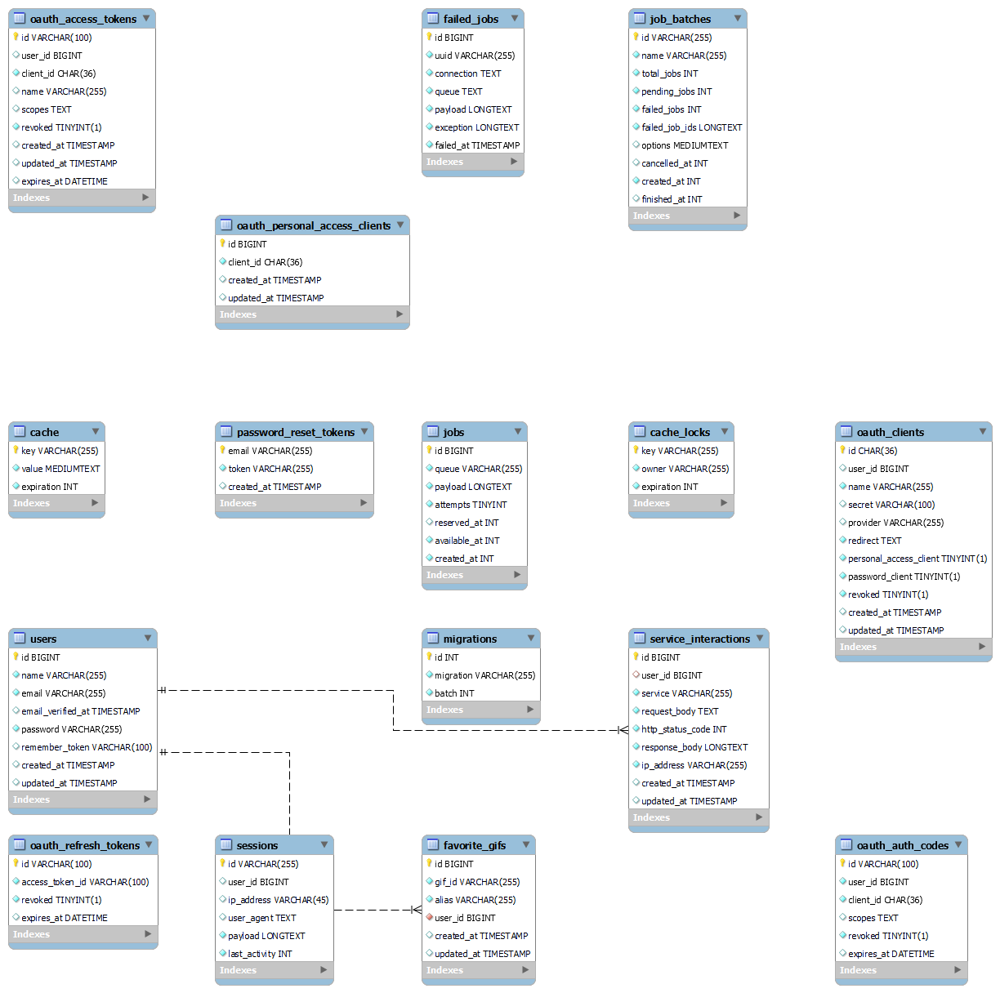
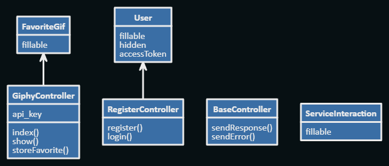
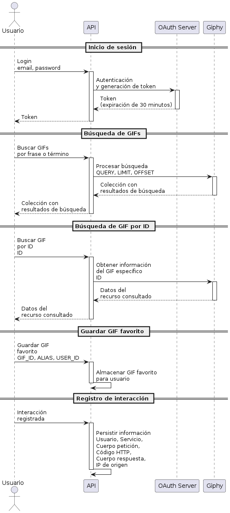
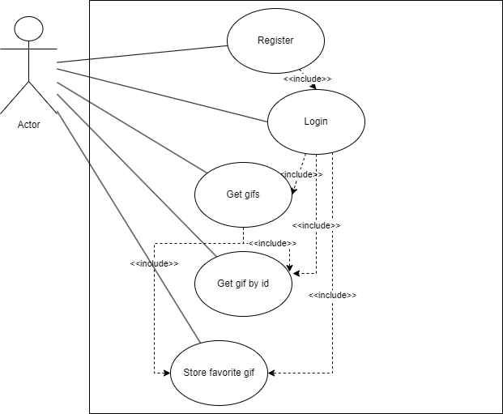

# Giphy API

Welcome to the giphy API project. This project provides a Dockerized setup for Laravel development, equipped with PHP 8.2, Apache, and MySQL.

## Requirements

* [Docker](https://docs.docker.com/get-docker/)
* [Docker compose](https://docs.docker.com/compose/install/)

## Getting Started

Follow these steps to set up your environment:

1. Clone this repository to your local machine:
   ```
   git clone https://github.com/teletubiii/giphy.git
   ```
2. Navigate to the project directory:
    ```
    cd giphy
    ```
3. Copy env example
    ```
    cp .env.example .env 
    ```
4. Start the Docker containers:
    ```
    docker-compose up -d
    ```
5. Wait a minute for the docker-entrypoint commands to finish executing.

6. Now you have a Laravel server up and running on port 8080, and you can access its services.


## Features

- Laravel Framework: Utilize the power of Laravel to build modern web applications.
- PHP 8.2: Benefit from the latest PHP features and improvements.
- Apache Web Server: Host your Laravel project with the Apache web server.
- MySQL Database: Manage your application's data with MySQL.
- Dockerized Environment: Ensure consistency and easy setup across different systems.
- Database Seeding and Migrations: Simplify database management during development.
- Sample Application: Start with a sample Laravel application or build from scratch.
- Composer Dependencies: Easily add and manage Composer packages for your Laravel app.
- Giphy API: You can query the Giphy API to retrieve GIFs and also save your favorite GIFs.

## Diagrams
* DER
    - 
* Classes
    - 
* Sequence
    - 
* Use cases
    - 
